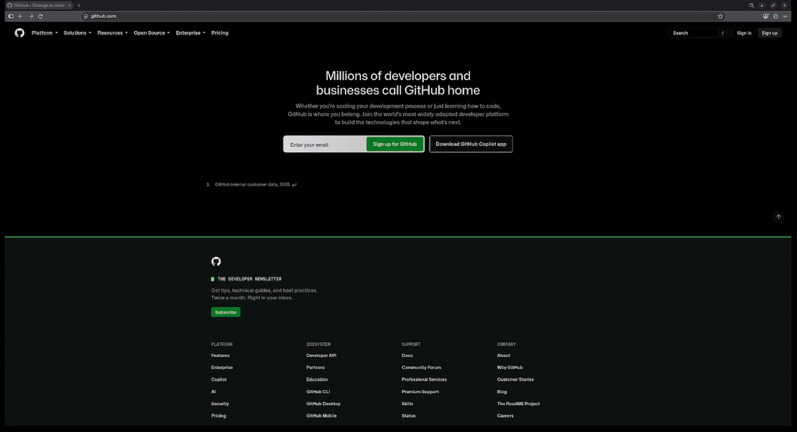

# firefox-floating-urlbar

A Zen-style floating URL bar for Firefox. Press **Ctrl+T**, type a URL or search, and press **Enter** to open it directly in a **new tab** — without leaving a blank tab in between. **Ctrl+L** also uses the floating URL bar while keeping Firefox's normal current-tab navigation.

It is a small [fx-autoconfig](https://github.com/MrOtherGuy/fx-autoconfig) user script plus a stylesheet. It does not replace your theme or require an extension.

## Demo

<p align="center">
  
</p>

The demo shows animation without dimming; current defaults are animation off and dimming on.

## Behaviour

| Action | Result |
| --- | --- |
| Ctrl+T (Cmd+T on macOS) | Centred URL bar; Enter opens the result in a new tab |
| Escape / click away | Cancels and restores the current page's address |
| Ctrl+L (Cmd+L on macOS) | Centred as well, but navigates in the **current** tab as usual |
| Clicking the normal address field | Stays in the toolbar; Firefox's suggestions, search, and editing work normally |
| Clicking inside the floating address field | Keeps the floating position and the current Ctrl+T/Ctrl+L navigation intent |
| F6 / Alt+D | Unchanged Firefox behavior; does not activate floating |
| `+` button, File → New Tab, Ctrl+N (Cmd+N on macOS) | Opens a normal tab or window with the URL bar in the toolbar |

Only Ctrl+T and Ctrl+L activate floating. It appears and returns to the toolbar
without sliding by default. During floating, the background is dimmed by 35% by default,
including when suggestions are disabled. The input, suggestions, and menus stay
above the dimming; clicking away still dismisses the floating bar.

## Requirements

- Firefox with [fx-autoconfig](https://github.com/MrOtherGuy/fx-autoconfig) already installed in your profile. This project does not install it for you.
- A Firefox with CSS anchor positioning support. Without it the stylesheet does nothing and the bar keeps its normal position.
- Tested on **Firefox 157.0 on Linux**.

> These files run with full browser privileges. Read them before installing, as you should with any user script.

## Install

### Linux (installer script)

```bash
git clone https://github.com/constantinemagnus/firefox-floating-urlbar.git
cd firefox-floating-urlbar
./install.sh
```

The installer finds your Firefox profiles, preselects the default one, copies the two files into `chrome/JS` and `chrome/CSS`, and keeps timestamped backups when existing files differ. You can pass a profile folder directly: `./install.sh --profile /path/to/profile`. Restart Firefox afterward; if changes do not appear, clear the startup cache in `about:support`.

The scripts refuse linked files, special files, and symlinked `chrome` directories. Automatic cache cleanup only removes a real `startupCache` directory inside the selected profile; clear external cache locations through `about:support`.

The included installer currently supports Linux. Windows and macOS users can use the manual steps below.

### Manual (any OS)

1. Copy `JS/replace-new-tab.uc.js` into your profile's `chrome/JS/` folder.
2. Copy `CSS/firefox-floating-urlbar.uc.css` into your profile's `chrome/CSS/` folder.
3. Close Firefox, open it again, then go to `about:support` and click **Clear startup cache**, and restart once more.

## Update

```bash
./update.sh
```

It fetches first, shows the new commits and changed files, and asks before applying exactly that revision and running the installer again. It refuses to run if tracked files have local edits. Pass `--yes` to skip the prompt, or `--choose` to pick a different profile. Explicit `--profile` or `--root` arguments take precedence over the saved profile.

If your branch is ahead of upstream, updating stops without installing. Run `./install.sh` directly to install your local revision.

## Uninstall

```bash
./uninstall.sh
```

Removes the two files (backing up installed files that differ from the repository copies) and never touches Firefox's `prefs.js`. Restart Firefox afterward; if the old behavior persists, clear the startup cache in `about:support`. If you ran an older version of this script, open `about:config` once and check that `browser.urlbar.openintab` is what you expect; reset it if you never set it yourself.

## Preferences (about:config, optional)

| Preference | Default | Meaning |
| --- | --- | --- |
| `uc.floatingurlbar.enabled` | `true` | Set to `false` to get Firefox's normal Ctrl+T back without uninstalling |
| `uc.floatingurlbar.debug` | `false` | Log what the script is doing to the Browser Console (Ctrl+Shift+J) |
| `uc.floatingurlbar.animate` | `false` | CSS-only toggle: enable the previous 0.3-second position/width animation |
| `uc.floatingurlbar.dim` | `true` | CSS-only toggle: dim the background by 35% during floating sessions |

Create these preferences as **Boolean** values in `about:config` to override
their defaults. Set `uc.floatingurlbar.animate` to `true` to enable animation, or
`uc.floatingurlbar.dim` to `false` to disable dimming without editing CSS.
Missing preferences use the defaults above. The system's reduced-motion
preference always disables the animation.

To adjust dimming, change `--floatingurlbar-dim-opacity` in
`CSS/firefox-floating-urlbar.uc.css`, or override it in `userChrome.css`:

```css
:root {
    --floatingurlbar-dim-opacity: 0.35 !important;
}
```

This optional strength adjustment accepts a number from `0` to `1` (opaque
black); use the Boolean preference to enable or disable dimming. Ordinary
address-bar clicks never enable dimming. Restart Firefox and clear the startup
cache after changing the stylesheet, as described in the installation steps.

## Other URL bar tweaks

If you already use other CSS or scripts that change how the URL bar looks or behaves (centred or floating URL bar mods, theme packs, custom `urlbar` rules in `userChrome.css`), disable those parts first. Two things positioning the same element will fight, and the result can be a misplaced or half-sized bar.

## How it works

While a Ctrl+T flow is active in a window, a navigation Firefox would have loaded in the current tab is redirected to a new tab. This is done by wrapping Firefox's internal "where should this open" method on that window's URL bar, so no global preference is changed and other windows are unaffected. A blank current tab is reused rather than stacking another one.

That method is internal to Firefox, and Mozilla is moving it (`UrlbarInput._whereToOpen` → `UrlbarChildController.whereToOpen`). The script wraps whichever one exists. If neither does, it logs a warning in the Browser Console and leaves Firefox's own Ctrl+T alone.

## Troubleshooting

- **Nothing changed after installing.** Clear the startup cache (`about:support` → *Clear startup cache*) and restart Firefox. Also confirm fx-autoconfig works by checking that other `.uc.js` scripts load.
- **Ctrl+T behaves like normal Firefox.** Set `uc.floatingurlbar.debug` to `true` in `about:config`, restart, and open the Browser Console (Ctrl+Shift+J). A working install logs `[Replace New Tab] wrapped whereToOpen` (newer Firefox, including 157) or `wrapped _whereToOpen` (older Firefox), followed by `loaded`. Other messages in the console (Region, TopSites, Glean, experiments) come from Firefox itself and can be ignored. If you see a warning that Firefox exposes neither `gURLBar._whereToOpen` nor `gURLBar.controller.whereToOpen`, your Firefox has moved that method again; please open an issue with your Firefox version and the console output.
- **The bar opens but isn't centred.** Firefox changed its URL bar markup. The selectors the stylesheet depends on are listed at the top of `CSS/firefox-floating-urlbar.uc.css`. Please open an issue with your Firefox version.
- **Enter opens in the current tab.** Turn on `uc.floatingurlbar.debug` and include the console output in an issue.

## Development checks

There is no build step. Run the regression tests with Node.js and Bash:

```bash
node --test tests/urlbar.test.cjs
bash tests/shell.test.sh
```

The URL-bar tests mock Firefox events and timers. Shell tests use temporary profiles and mocked Git; they do not update your real profile or repository. Also verify shortcuts, cancellation, search-engine selection, and popup alignment in Firefox, including with zero-prefix suggestions disabled.

Check Ctrl+T/Ctrl+L navigation and click-away for flashes or toolbar movement.
Verify normal address-bar clicks, F6, and Alt+D stay in the toolbar, while clicks
inside the floating bar preserve it. Check dimming with its preference absent,
`true`, and `false`, with suggestions enabled and disabled, and during engine
menus. Test animation with dimming on and off for transient shadows, including
when suggestions first open or close. Check reduced motion on and off.
On `about:preferences`, test blank space/text and controls separately; dismissal
must preserve each control's normal behavior.

## License and attribution

Licensed under GPL-3.0 (see `LICENSE`). The new-tab replacement was originally
adapted from [Natsumi Browser](https://github.com/greeeen-dev/natsumi-browser)
(source file: MIT), and the centered URL-bar CSS was adapted from
[FlexFox](https://github.com/yuuqilin/FlexFox) (MIT). See `ATTRIBUTION.md` for
full attribution and license details.

